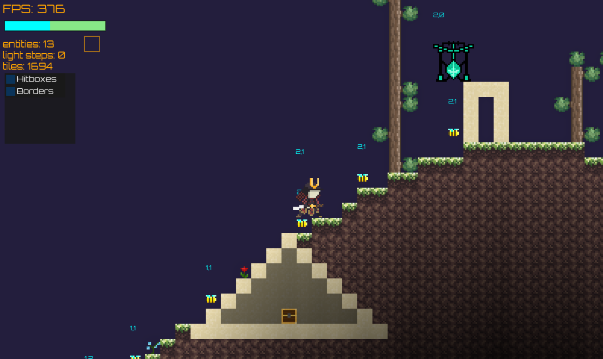
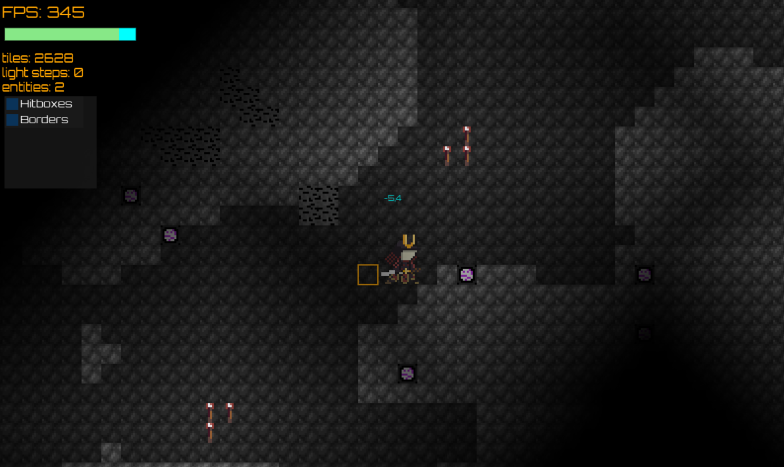

# Blockingdom
is a game

## Technical info
- Language: LuaJIT 5.1
- Graphics library: [Love2D](https://love2d.org/)
- Entities: proprietary ECS heavily inspired by [esper](https://github.com/benmoran56/esper) for Python (added chunk support)
- World generation:
    - Resource management: chunking `N × N` areas (currently `16 × 16`)
    - Cave generation: 2D [simplex noise](https://en.wikipedia.org/wiki/Simplex_noise) / 2D [ridge](https://stackoverflow.com/questions/36796829/procedural-terrain-with-ridged-fractal-noise) noise
- Lighting: iterative BFS every `N` frames. The lower the `N`, the smoother light updates feel, but the slower it is. An `N > 1` is also harder to profile. The lightmap is then converted to an `imageData` object, which is then converted to a GPU texture. This texture is mapped onto the main window as a fragment shader, which also takes care of smoothing.

## Preview

